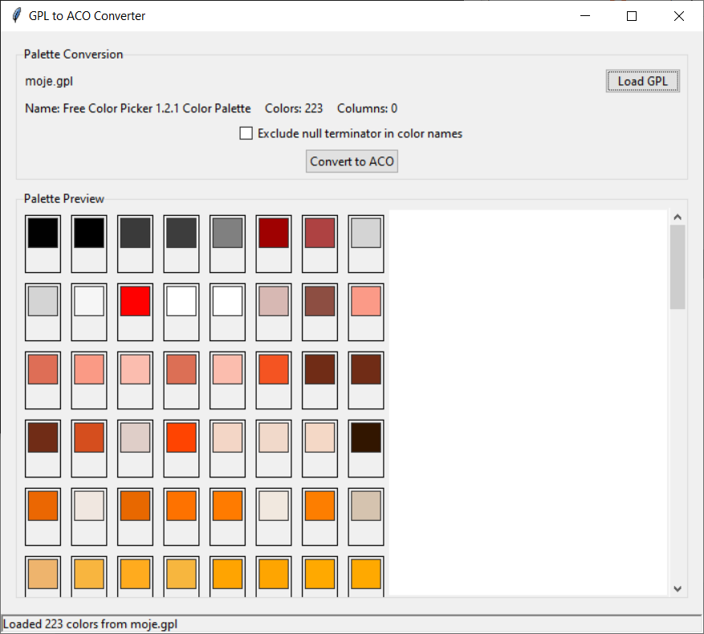

# GPL to ACO Converter

A user-friendly GUI application that converts GIMP palette files (.gpl) to Adobe Photoshop color swatch files (.aco).

## Features
🎨 Load and preview GIMP palette files (.gpl)

🔍 View palette details (name, color count, columns)

👁️ Visual color swatch preview with tooltips

⚙️ Option to exclude null terminator in color names

💾 Save as Photoshop color swatch (.aco) format

🖼️ Scrollable preview for large palettes

✅ Robust error handling and user feedback

## Requirements
Python 3.6+

Tkinter (included with Python)

No additional libraries required!

bash
python main.py
Usage
Click "Load GPL" to select a GIMP palette file (.gpl)

View palette details and color preview

(Optional) Check "Exclude null terminator" if Photoshop has issues reading color names

Click "Convert to ACO" to save the palette as a Photoshop color swatch file (.aco)

## Supported File Formats
Input: GIMP Palette files (.gpl)
Output: Adobe Photoshop Color Swatch files (.aco)

Compatibility
Handles UTF-8 BOM files

Supports mixed space/tab separators

Works with palettes with or without color names

Compatible with both Windows and macOS

Verify the palette preview matches your expectations before converting

Contributing
Contributions are welcome! Please open an issue or submit a pull request.
